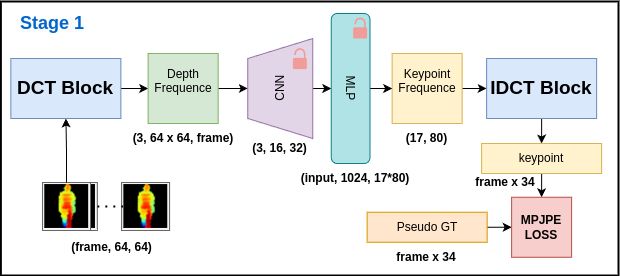

# 2D Human Pose Estimation from Depth Maps

## Table of Contents

- [2D Human Pose Estimation from Depth Maps](#2d-human-pose-estimation-from-depth-maps)
  - [Table of Contents](#table-of-contents)
  - [Introduction](#introduction)
  - [Features](#features)
  - [Model Architecture](#model-architecture)
  - [Demo](#demo)
  - [How to Use](#how-to-use)
  - [Acknowledgements](#acknowledgements)
  - [Future Work](#future-work)
  - [License](#license)
  - [Contributing](#contributing)

## Introduction

This repository contains the code for 2D human pose estimation. We have implemented two distinct models, one focusing on the spatial domain and the other on the frequency domain, using the [SUSTech1K dataset](https://github.com/ShiqiYu/OpenGait/blob/master/datasets/SUSTech1K/README.md). Unlike most human pose estimation tasks, our approach emphasizes privacy preservation by using depth images as input rather than raw images. The output is the keypoints representing human skeletal structure in the original image.

This design allows us to predict human poses without exposing any visual information, making our models ideal for privacy-sensitive applications. For example, in eldercare facilities, radar can be used to capture depth information, which our models can then process to monitor the safety of elderly individuals. Moving forward, we plan to integrate spatial and frequency domain features to develop a more comprehensive and accurate model.

## Features

- **Depth Image Input:** The models accept depth images as input, eliminating the need for any raw image data.
- **Pose Prediction:** Outputs the keypoints representing human skeletal structure.
- **Privacy-Preserving:** Ensures complete privacy protection by working solely with depth information.
- **Potential Applications:** Broad applicability in privacy-sensitive areas such as healthcare and surveillance.

## Model Architecture



## Demo


## How to Use

1. Clone this repository:

   ```bash
   git clone git@github.com:Sebastian-0912/HumanPose_Cnn.git
   ```

2. Install the required dependencies:

    ```bash
    pip install -r requirements.txt
    ```

## Acknowledgements

We would like to extend our gratitude to the authors of the SUSTech1K dataset for providing a high-quality dataset, which was instrumental in training our models.

## Future Work

We are planning to combine spatial and frequency domain features to create a more robust and precise model. Additionally, we aim to explore the potential of our models in various real-world applications, particularly in areas requiring enhanced privacy protection.

## License

This project is licensed under the [MIT License](./LICENSE). See the LICENSE file for details.

## Contributing

We welcome contributions to this project. If you have any ideas, suggestions, or bug reports, please open an issue or submit a pull request.